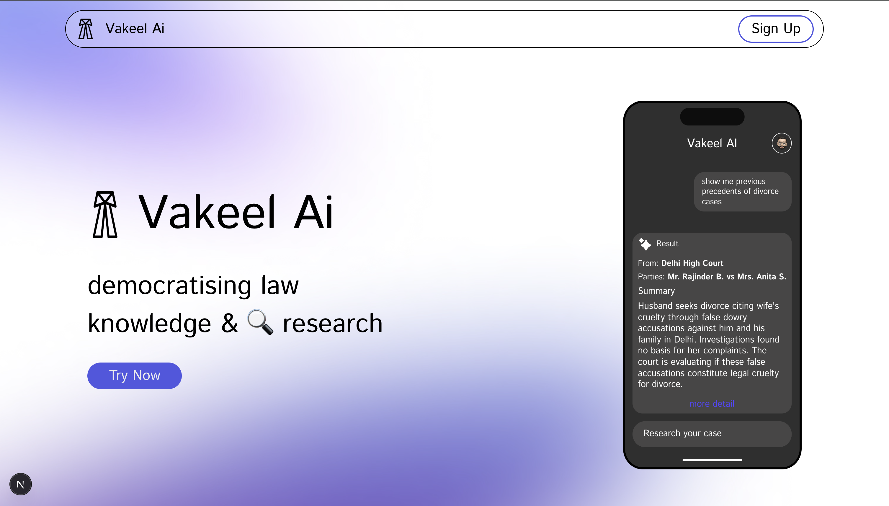
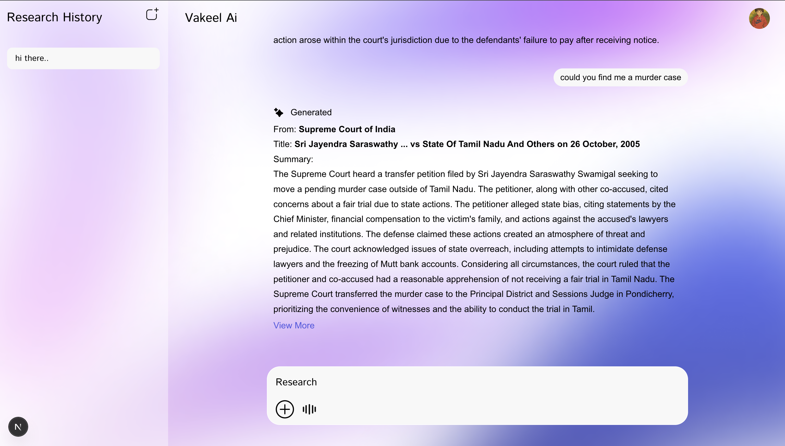
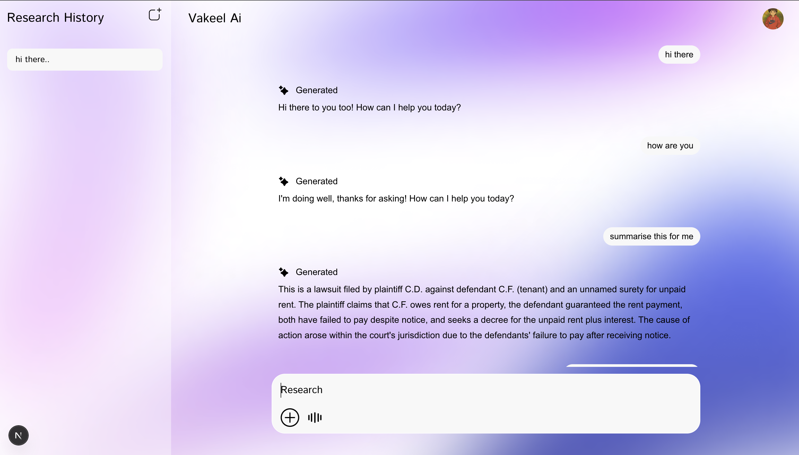

# Vakeel AI  (Website - https://vakeel-ai.vercel.app/)

_The legal assistant you never knew you needed, but always wanted._

---

## 🚀 Overview  
**Vakeel AI** is an AI-powered legal research assistant designed to make the Indian legal ecosystem faster, smarter, and more accessible. Search millions of real court judgments, get simplified case summaries, ask legal questions in natural language, and generate citation-ready case notes in minutes.

---

## 📺 Demo-video 
  - https://youtu.be/wT9OfX2xYgg

## ✨ Key Features  
- **Deep Legal Research**  
  Search through lakhs of real court judgments across the Supreme Court, High Courts, and District Courts.  
- **AI Case Summaries**  
  No more legal jargon — get easy-to-understand summaries tailored for lawyers and the common man.  
- **Simple Language Query**  
  Ask legal questions like: _"Find me a fake domestic violence case"_ and get relevant judgments.  
- **Auto-Generated Case Notes**  
  Instantly convert your research into well-structured, citation-ready notes, saving hours of prep for lawyers.

---

## 🛠️ Tech Stack  
- **Frontend**: Next.js & CSS  
- **Authentication & Storage**: Firebase & MongoDB  
- **AI & APIs**: Gemini, OpenAI, Indian Kanoon  

---

## 💳 Subscription Plans  
- **Common Man**: ₹0 / month  
- **Attorney's Plan**: ₹499 / month  
- **Enterprise Plan**: ₹399 / member  

---

## ⚙️ How It Works
1. **Sign Up / Log In**: Create an account using simple authentication (via Firebase).  
2. **Search & Discover**: Use AI-powered search to explore millions of case judgments.  
3. **Ask & Understand**: Input your questions in plain English — the AI fetches and simplifies the results.  
4. **Generate Notes**: Save your research into auto-generated case notes, ready for court or case preparations.  
5. **Upgrade Anytime**: Unlock premium features with easy subscription plans for lawyers and law firms.

---

## 📸 Screenshots  

| Feature              | Screenshot                            |
|----------------------|----------------------------------------|
| **Home Page**        |       |
| **Search Results**   |  |
| **Case Summary**     |  |

---

## 🤝 Contributors  
Thanks to these amazing people for bringing Vakeel AI to life!

| Name               | Role                          |
|--------------------|-------------------------------|
| **Ashish Kumar**    | Fullstack Developer           |
| **Yuvraj Sharma**   | Frontend Developer           |
| **Gauri Pandey**    | Frontend Developer            |
| **Aditya Maitrey**  | AI Developer (AI Guy)          |
| **Meghna Kandpal**  | Authentication & Database Expert |

---

## ❤️ Made with love by Team Pallets  
